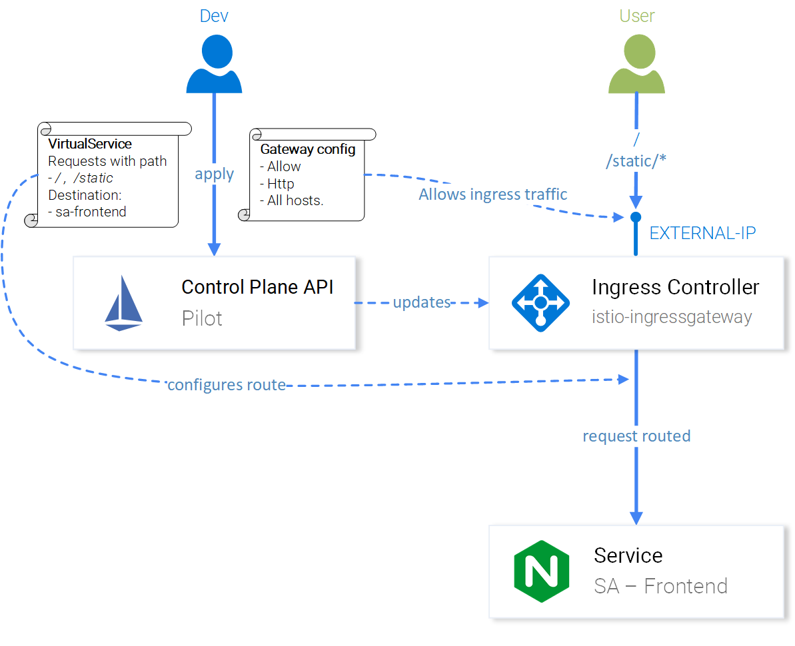
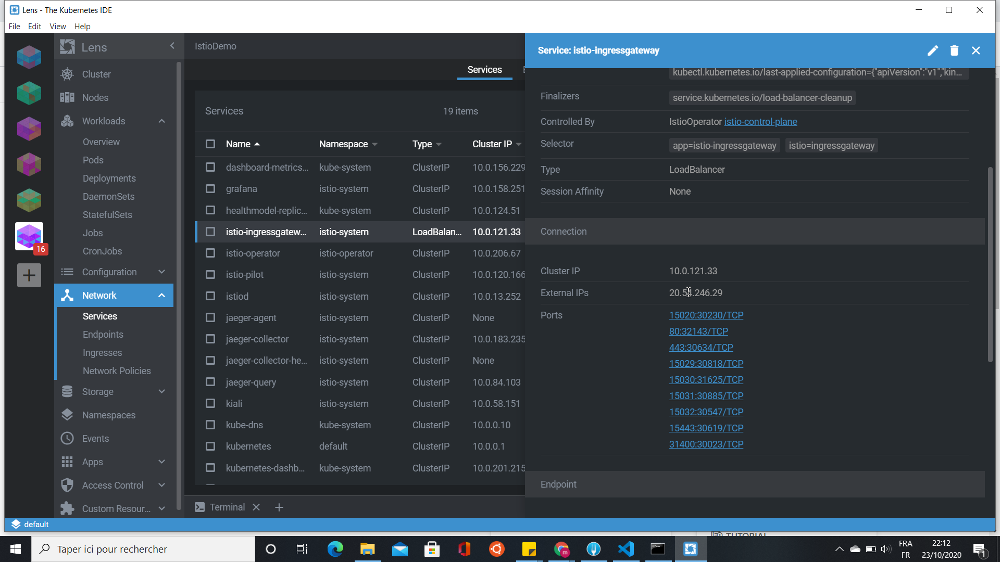
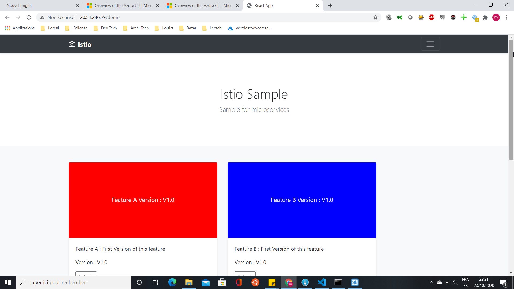
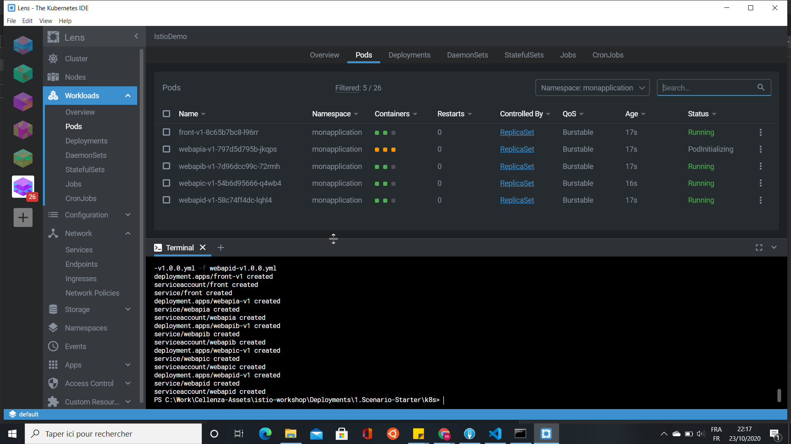
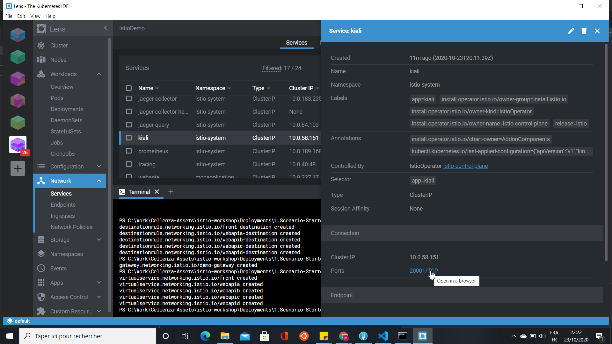
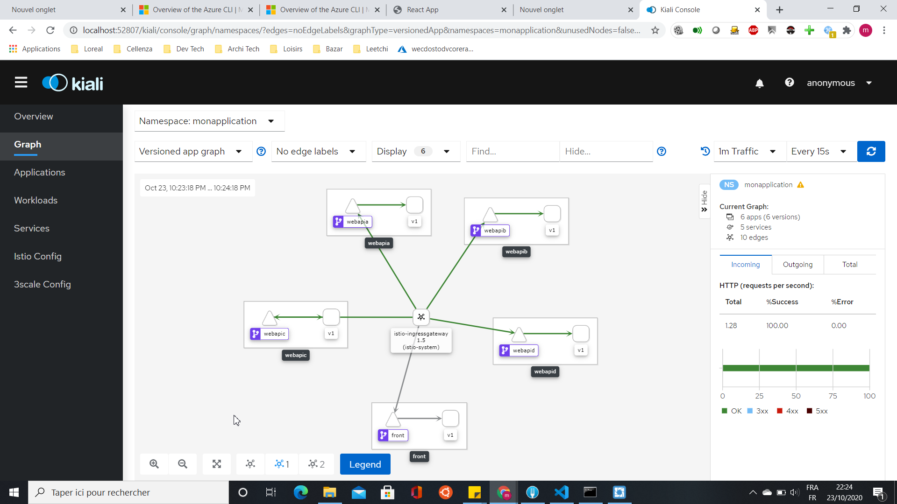
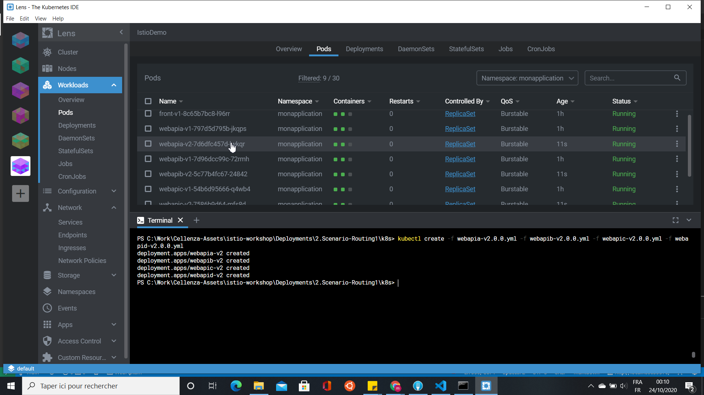
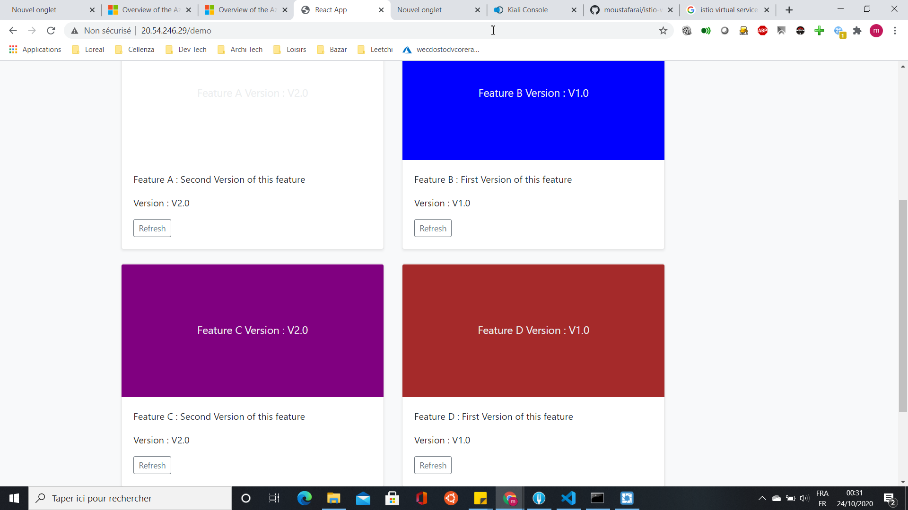
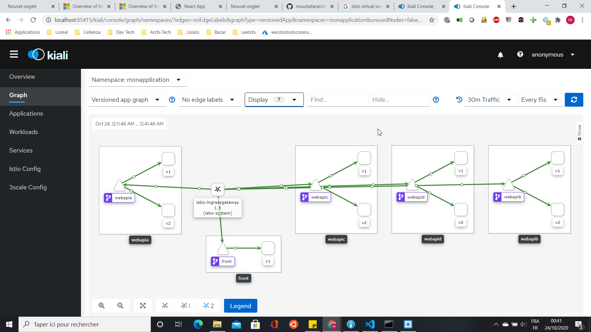

# Istio - Workshop

Dans un [précedent article](https://blog.cellenza.com/uncategorized/istio-et-le-service-mesh-kubernetes/) nous avons pu voir ensemble le concept de service mesh et plus précisement Istio et son fonctionnement.

Nous avons pu voir ensemble les composants du controle plane et du data plane.

Aujourd'hui nous allons nous pencher sur des quelques cas pratiques de routing.

Pré-requis :

- Helm : 

    ```powershell
    choco install kubernetes-helm
    ```
- kubectl:

    ```powershell
    choco install kubernetes-cli
    ```

- az cli: 

    ```powershell
    choco install azure-cli
    ```
- Lens : Kubernetes IDE [lien](https://github.com/lensapp/lens/releases/latest) 


Nous allons aborder ces differents sujets :

- La mise en place d'istio
- Comment mettre en place une stratégie de routing dans votre application


# Mise en Place  d'Istio

## Création d'un Cluster AKS

Commencons par la création d'un cluster AKS via ce script.
Ce cluster AKS que nous allons déployer n'est pas ready to prod.
Cette configuration minimaliste n'est déstiné que pour cette démo.

```powershell
$resourcegroup="DV-AKS-RG"
$clusterAks="akscluster"

az login
az group create --name $resourcegroup --location westeurope
az aks create --resource-group $resourcegroup --name $clusterAks --node-count 3 --enable-addons monitoring --generate-ssh-keys

az aks get-credentials -n $akscluster -g $resourcegroup
```
Bilan : nous avons créer un cluster dans un ressource group et nous avons injecter la config de notre cluster sur notre machine. 
A partir de la nous pouvons dores et déja faire des appels kubectl sur notre nouveau cluster.

## Installation d'Istio

Cette étapes consiste à effectuer l'installation d'istio sur notre cluster.
Nous allons commencer par télécharger le CLI IstioCtl et l'ajouter au path de notre environment :

```powershell
$ISTIO_VERSION="1.7.3"

[Net.ServicePointManager]::SecurityProtocol = "tls12"
$ProgressPreference = 'SilentlyContinue'; Invoke-WebRequest -URI "https://github.com/istio/istio/releases/download/$ISTIO_VERSION/istioctl-$ISTIO_VERSION-win.zip" -OutFile "istioctl-$ISTIO_VERSION.zip"
Expand-Archive -Path "istioctl-$ISTIO_VERSION.zip" -DestinationPath .

New-Item -ItemType Directory -Force -Path "C:\Istio"
Move-Item -Path .\istioctl.exe -Destination "C:\Istio\"

$USER_PATH = [environment]::GetEnvironmentVariable("PATH", "User") + ";C:\Istio\"
[environment]::SetEnvironmentVariable("PATH", $USER_PATH, "User")
$env:PATH += ";C:\Istio\"
```

Istio fourni un operateur pour gérer ses installations et ses mises à jour dans le cluster.
Nous l'installons via cette commande:

```powershell
istioctl operator init
``` 

Nous devons ajouter un namespace afin de faire les choses proprement et installer istio dans son propre namespace

```powershell
kubectl create ns istio-system
```

Nous allons créer le fichier istio.aks.yaml qui décrit les specifications de l'opérateur Istio afin d'ajouter des composants utiles (grafana,prometheus,kiali)

```yaml
apiVersion: install.istio.io/v1alpha1
kind: IstioOperator
metadata:
  namespace: istio-system
  name: istio-control-plane
spec:
  # Use the default profile as the base
  # More details at: https://istio.io/docs/setup/additional-setup/config-profiles/
  profile: default
  # Enable the addons that we will want to use
  addonComponents:
    grafana:
      enabled: true
    prometheus:
      enabled: true
    tracing:
      enabled: true
    kiali:
      enabled: true
  values:
    global:
      # Ensure that the Istio pods are only scheduled to run on Linux nodes
      defaultNodeSelector:
        beta.kubernetes.io/os: linux
    kiali:
      dashboard:
        auth:
          strategy: anonymous
``` 

Et enfin nous déployons la configuration de l'opérateur istio sur le cluster.

```powershell
kubectl apply -f istio.aks.yaml
``` 

# Stratégie de routing

## Vocabulaire / Définitions

Avant de rentrer dans le vif du sujet voici une liste de definition de concept Istio:

| Concept | Definition |
| -- | -- |
| Gateways | La gateway est la passerelle de notre service mesh. Elle permet de controler le trafic entrant et sortant de notre service mesh.|
|Virtual Service| Un Virtual Service se compose d'un ensemble de règles de routage qui sont évaluées dans l'ordre, permettant à Istio de faire correspondre chaque demande donnée au service virtuel à une destination réelle spécifique dans le maillage|
|Destination Rule||




Suite à l'installation d'istio l'ingress-controller d'Istio sera notre unique point d'entrée vers nos applications hébergés dans le cluster.

Pour le connaitre nous allons utiliser l'IDE Lens pour retrouver l'ip public de l'ingress controller d'istio dans la section Network > Service >



Pour en savoir plus sur Lens cliquez sur ce lien : [link](https://docs.k8slens.dev/latest/getting-started/)

## Use Case

Nous allons travailler sur une application simpliste :
Une application React qui appelle 4 webapi net core.

Les sources sont disponible sur github : [lien]
Pour continuer sur ce tutoriel merci de cloner ce repository

(https://github.com/moustafarai/istio-workshop)




## Configuration préalable : le namespace

Nous allons créer un namespace pour notre nouvelle application :
```powershell
kubectl create namespace monapplication
```
Afin de profiter du mécanisme d'injection d'istio de facon implicite nous allons ajouter un label au namespace :

```powershell
kubectl label namespace monapplication istio-injection=enabled
```
Pour simplifier : A chaque déploiement dans ce namespace istio se chargera de mettre en place un pod (envoy) en mode side-car.

## Scénario 1

Nous avons développer une nouvelle application front. 

Cette application dispose de 4 features.

Chaque feature fait appel a une nouvelle Web Api.

Nous souhaitons mettre à disposition la version 1.0 de ces nouvelles features (Web Api).

Nous sommes donc dans un cas simple de routage.

Nous allons exposer nos services via une gateway puis router simplement nos services sur la version 1.0 


Voici le fichier yaml de l'application front : 

```yaml
apiVersion: apps/v1
kind: Deployment
metadata:
  namespace: monapplication
  name: front-v1
  labels:
    app: front
    version: v1
spec:
  selector:
    matchLabels:
      app: front
      version: v1
  replicas: 1
  template:
    metadata:
      labels:
        app: front
        version: v1
    spec:
      serviceAccountName: front
      containers:
      - name: front
        image: moustafarai/front:1.0.0
        stdin: true
        tty: true
        resources:
          requests:
            cpu: "200m"
            memory : "500Mi"
          limits:
            cpu: "0.4"
            memory : "701Mi"
        ports:
        - containerPort: 3000
          protocol: TCP
---
apiVersion: v1
kind: ServiceAccount
metadata:
  namespace: monapplication
  name: front
  labels:
    account: front
---
apiVersion: v1
kind: Service
metadata:
  namespace: monapplication
  name: front
  labels:
    app: front
    service: front
spec:
  ports:
  - name: http
    port: 3000
  selector:
    app: front
```

Nous avons defini dans ce fichier yaml les composants suivants :
- Le service Account
- Le service
- Le déploiement du pod

Le service ne doit pas être exposer publiquement il est de type clusterip

Istio à besoin de connaitre votre version dans les métadata pour fonctionner:
version: v1


Nous allons déployer les 4 applications sur le cluster. 

Les fichiers yamls sont disponible dans le repertoire /Deployments/Scenario-Starter/k8s

Nous devons executer la commande suivante pour les déployer dans le cluster :
```powershell
kubectl create -f front-v1.0.0.yml -f webapia-v1.0.0.yml -f webapib-v1.0.0.yml -f webapic-v1.0.0.yml -f webapid-v1.0.0.yml
```
Nous pouvons observer le deploiement depuis Lens.



Suite au déploiement, votre application n'est pas joignable depuis internet.

Nous devons configurer la route.

Pour cela nous devons dans un premier temps définir la configuration de la gateway :
```yaml
apiVersion: networking.istio.io/v1alpha3
kind: Gateway
metadata:
  namespace: monapplication
  name: demo-gateway
spec:
  selector:
    istio: ingressgateway # use istio default controller
  servers:
  - port:
      number: 80
      name: http
      protocol: HTTP
    hosts:
    - "*"
```

Nous allons effectuer son déploiement :
```powershell
kubectl apply -f gateway.yaml
```

Nous avons ouvert le port 80.

La deuxieme étape consiste à definir les subsets dans les destination rules de toutes nos applications :
```yaml
apiVersion: networking.istio.io/v1alpha3
kind: DestinationRule
metadata:
  namespace: monapplication
  name: front-destination
spec:
  host: front
  subsets:
  - name: v1
    labels:
      version: v1
---
apiVersion: networking.istio.io/v1alpha3
kind: DestinationRule
metadata:
  namespace: monapplication
  name: webapia-destination
spec:
  host: webapia
  subsets:
  - name: v1
    labels:
      version: v1
---
apiVersion: networking.istio.io/v1alpha3
kind: DestinationRule
metadata:
  namespace: monapplication
  name: webapib-destination
spec:
  host: webapib
  subsets:
  - name: v1
    labels:
      version: v1
---
apiVersion: networking.istio.io/v1alpha3
kind: DestinationRule
metadata:
  namespace: monapplication
  name: webapic-destination
spec:
  host: webapic
  subsets:
  - name: v1
    labels:
      version: v1
---
apiVersion: networking.istio.io/v1alpha3
kind: DestinationRule
metadata:
  namespace: monapplication
  name: webapid-destination
spec:
  host: webapid
  subsets:
  - name: v1
    labels:
      version: v1
```

Dans une DestinationRule un subset permet de définir plusieurs versions pour une meme destination.

Un subset est un sous ensemble d'une destination rule. Celui ci pointera vers l'application matchant avec son label.

Dans notre premier scénario un seul subset sera defini.

Le subset de la webapi A pointera sur la web api ayant le label version v1:
```
labels:
    app: webapia
    version: v1  
```


Nous allons effectuer son déploiement :
```yaml
kubectl apply -f destinationrules.yaml
```

Pour le moment nous n'avons qu'une seule version : la v1.

Les subsets sont maintenant liés à la version v1.

La dernière étape du routing est de faire le lien entre la gateway et les destinations rules.

Voici le fichier virtualservice.yaml :

```yaml

apiVersion: networking.istio.io/v1alpha3
kind: VirtualService
metadata:
  namespace: monapplication
  name: front
spec:
  hosts:
  - "*"
  gateways:
  - demo-gateway
  http:
  - match:
    - uri:
        prefix: "/demo"
    - uri:
        prefix: /static
    route:
    - destination:
        subset: v1
        host: front
        port:
          number: 3000
---
apiVersion: networking.istio.io/v1alpha3
kind: VirtualService
metadata:
  namespace: monapplication
  name: webapia
spec:
  hosts:
  - "*"
  gateways:
  - demo-gateway
  http:
  - match:
    - uri:
        prefix: "/ServiceA"
    route:
    - destination:
        subset: v1
        host: webapia
        port:
          number: 80
---
apiVersion: networking.istio.io/v1alpha3
kind: VirtualService
metadata:
  namespace: monapplication
  name: webapib
spec:
  hosts:
  - "*"
  gateways:
  - demo-gateway
  http:
  - match:
    - uri:
        prefix: "/ServiceB"
    route:
    - destination:
        subset: v1
        host: webapib
        port:
          number: 80
---
apiVersion: networking.istio.io/v1alpha3
kind: VirtualService
metadata:
  namespace: monapplication
  name: webapic
spec:
  hosts:
  - "*"
  gateways:
  - demo-gateway
  http:
  - match:
    - uri:
        prefix: "/ServiceC"
    route:
    - destination:
        subset: v1
        host: webapic
        port:
          number: 80
---
apiVersion: networking.istio.io/v1alpha3
kind: VirtualService
metadata:
  namespace: monapplication
  name: webapid
spec:
  hosts:
  - "*"
  gateways:
  - demo-gateway
  http:
  - match:
    - uri:
        prefix: "/ServiceD"
    route:
    - destination:
        subset: v1
        host: webapid
        port:
          number: 80
```
Nous matchons les differents prefixes de route vers les destinations rules. 

Et plus précisement sur le subset v1 de chaque application.

Notre site est maintenant disponible sur le web à l'adresse suivante :
http://< ip-public-de-l-istio-ingress>/demo


## Monitoring

Nous allons maintenant utiliser l'add-on kiali.
Kiali est un add-on permettant de configurer et monitorer notre service mesh.

Nous pouvons y acceder directement depuis L'IDE Lens.

Pour cela il suffit d'aller dans la rubrique Network > Service.
De cliquer sur le detail du service kiali et de cliquer sur le lien




Sur le dashboard de kiali nous pouvons ainsi consulter le graph de notre service mesh dans le namespace monapplication 

Pour en savoir plus sur Kiali cliquez sur ce lien : [Link](https://kiali.io/documentation/)



## Scénario 2

Une nouvelle feature de nos web api est disponible : la version 2.

Nous souhaitons que les internautes puissent tester la nouvelle feature de nos apis.

Pour cela nous allons équilibrer le traffic entre l'ancienne version (v1) et la nouvelle (v2).

Nous allons rediriger 50 % du traffic sur la version 1 et 50 % du traffic sur la version 2. 

Nous allons déployer la nouvelle version des apis dans le cluster.

Voici le yaml de la webapi A version 2 : 

```yaml
apiVersion: apps/v1
kind: Deployment
metadata:
  namespace: monapplication
  name: webapia-v2
  labels:
    app: webapia
    version: v2
spec:
  selector:
    matchLabels:
      version: v2
      app: webapia
  replicas: 1
  template:
    metadata:
      labels:
        version: v2
        app: webapia
    spec:
      serviceAccountName: webapia
      containers:
      - name: webapia
        image: moustafarai/webapia:2.0.0
        resources:
          requests:
            cpu: "200m"
            memory : "200Mi"
          limits:
            cpu: "0.4"
            memory : "201Mi"
        ports:
        - containerPort: 80
          protocol: TCP
```
Nous n'allons pas visualiser toutes les api.
Le seul élement changeant est la version : v2 dans les labels

Nous allons déployer toutes les web apis via cette commande dans le repertoire Deployments/2.Scenario-Routing1/k8s :

```powershell
kubectl create -f webapia-v2.0.0.yml -f webapib-v2.0.0.yml -f webapic-v2.0.0.yml -f webapid-v2.0.0.yml
```

Après une petite verification du bon déroulement sur Lens nous pouvons passer à la suite




Nous pouvons voir que nous avons 2 version de subset dans les destination rules dans notre fichier Deployments/2.Scenario-Routing1/istio/destinationrules.yaml

```yaml
apiVersion: networking.istio.io/v1alpha3
kind: DestinationRule
metadata:
  namespace: monapplication
  name: front-destination
spec:
  host: front
  subsets:
  - name: v1
    labels:
      version: v1
---
apiVersion: networking.istio.io/v1alpha3
kind: DestinationRule
metadata:
  namespace: monapplication
  name: webapia-destination
spec:
  host: webapia
  subsets:
  - name: v1
    labels:
      version: v1
  - name: v2
    labels:
      version: v2
---
apiVersion: networking.istio.io/v1alpha3
kind: DestinationRule
metadata:
  namespace: monapplication
  name: webapib-destination
spec:
  host: webapib
  subsets:
  - name: v1
    labels:
      version: v1
  - name: v2
    labels:
      version: v2
---
apiVersion: networking.istio.io/v1alpha3
kind: DestinationRule
metadata:
  namespace: monapplication
  name: webapic-destination
spec:
  host: webapic
  subsets:
  - name: v1
    labels:
      version: v1
  - name: v2
    labels:
      version: v2
---
apiVersion: networking.istio.io/v1alpha3
kind: DestinationRule
metadata:
  name: webapid-destination
spec:
  host: webapid
  subsets:
  - name: v1
    labels:
      version: v1
  - name: v2
    labels:
      version: v2
```

Deployons cette nouvelle version : 

```powershell
kubectl apply -f Deployments/2.Scenario-Routing1/istio/destinationrules.yaml
```

Nous allons tester le routing par poid avec la répartition suivante :
- 50 % du traffic sur la version 1 des webapis
- 50 % du traffic sur la version 2 des webapis

Voici la definition des Virtual Service de nos web apis :
```yaml

apiVersion: networking.istio.io/v1alpha3
kind: VirtualService
metadata:
  namespace: monapplication
  name: front
spec:
  hosts:
  - "*"
  gateways:
  - demo-gateway
  http:
  - match:
    - uri:
        prefix: "/demo"
    - uri:
        prefix: /static
    route:
    - destination:
        subset: v1
        host: front        
        port:
          number: 3000
      
---
apiVersion: networking.istio.io/v1alpha3
kind: VirtualService
metadata:
  namespace: monapplication
  name: webapia
spec:
  hosts:
  - "*"
  gateways:
  - demo-gateway
  http:
  - match:
    - uri:
        prefix: "/ServiceA"
    route:
    - destination:
        subset: v1
        host: webapia
        port:
          number: 80
      weight: 50
    - destination:
        subset: v2
        host: webapia
        port:
          number: 80
      weight: 50
---
apiVersion: networking.istio.io/v1alpha3
kind: VirtualService
metadata:
  namespace: monapplication
  name: webapib
spec:
  hosts:
  - "*"
  gateways:
  - demo-gateway
  http:
  - match:
    - uri:
        prefix: "/ServiceB"
    route:
    - destination:
        subset: v1
        host: webapib
        port:
          number: 80
      weight: 50
    - destination:
        subset: v2
        host: webapib
        port:
          number: 80
      weight: 50
---
apiVersion: networking.istio.io/v1alpha3
kind: VirtualService
metadata:
  namespace: monapplication
  name: webapic
spec:
  hosts:
  - "*"
  gateways:
  - demo-gateway
  http:
  - match:
    - uri:
        prefix: "/ServiceC"
    route:
    - destination:
        subset: v1
        host: webapic
        port:
          number: 80
      weight: 50
    - destination:
        subset: v2
        host: webapic
        port:
          number: 80
      weight: 50
---
apiVersion: networking.istio.io/v1alpha3
kind: VirtualService
metadata:
  namespace: monapplication
  name: webapid
spec:
  hosts:
  - "*"
  gateways:
  - demo-gateway
  http:
  - match:
    - uri:
        prefix: "/ServiceD"
    route:
    - destination:
        subset: v1
        host: webapid
        port:
          number: 80
      weight: 50
    - destination:
        subset: v2
        host: webapid
        port:
          number: 80
      weight: 50
```

Passons à l'execution de la configuration :
```powershell
kubectl apply -f Deployments/2.Scenario-Routing1/istio/virtualservice.yaml
```

Nous pouvons de nouveau tester l'application afin de voir son comportement.



Nous pouvons remarquer qu'a chaque refresh de la page nous pouvons passer de la version 1 à la version 2 de l'application.

Nous n'avons pas configuré d'affinité dans cette démo.
Cependant il est possible de le faire pour rester sur une version afin de garder une cohérence de votre application.

Maintenant passons sur kiali afin d'observer le service mesh.

Nous pouvons dores et déja constater que le graphe à changer :



Nous avons maintenant un routing alétoire 50/50 sur nos webapis.

# Conclusion

Nous avons abordé dans cet article la mise en place d'Istio dans un context de routing.

Nous sommes resté très simpliste sur le concept de Trafic d'Istio. Nous pouvons allez encore plus loin et utiliser d'autres option pour rediriger le traffic (cookies,header, etc..). Istio est très complet et permet de répondre aux attentes et contraintes du monde de l'IT.

Parmis toutes les solutions de service mesh existantes (Linkerd,Consul,etc...) Istio reste le plus avancé. Il peut être un peu complexe à mettre à l'echelle néamoins Il est le plus abouti.


Si vous souhaitez allez plus loin sur le traffic management d'Istio : [Traffic Management](https://istio.io/latest/docs/tasks/traffic-management/)
